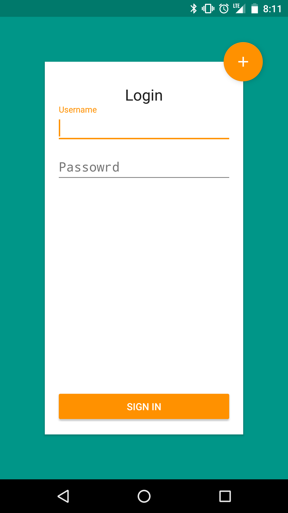

## Udacity Capstone Project

### Key Features
  - Log in using firebase
  - Schedule automated text messages for contacts on your device
  - Log in to new devices to schedule saved messages on that new device

### Technical Features
  - Written in Kotlin
  - Use Firebase for backend support
  - Dagger2 for dependency injection

### Sign In Screen

